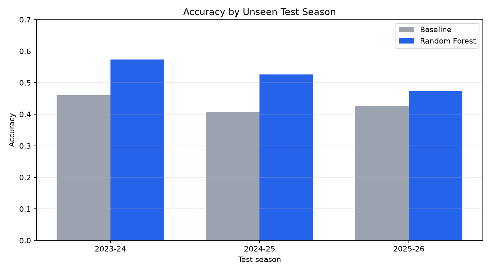
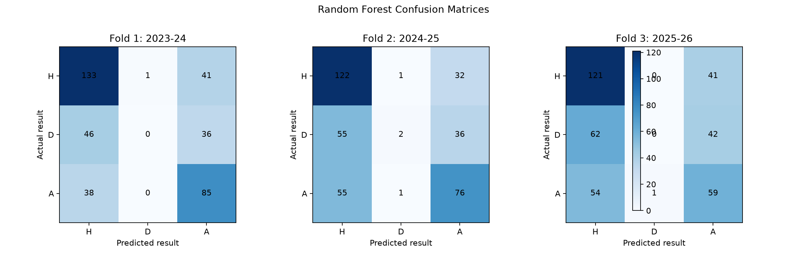
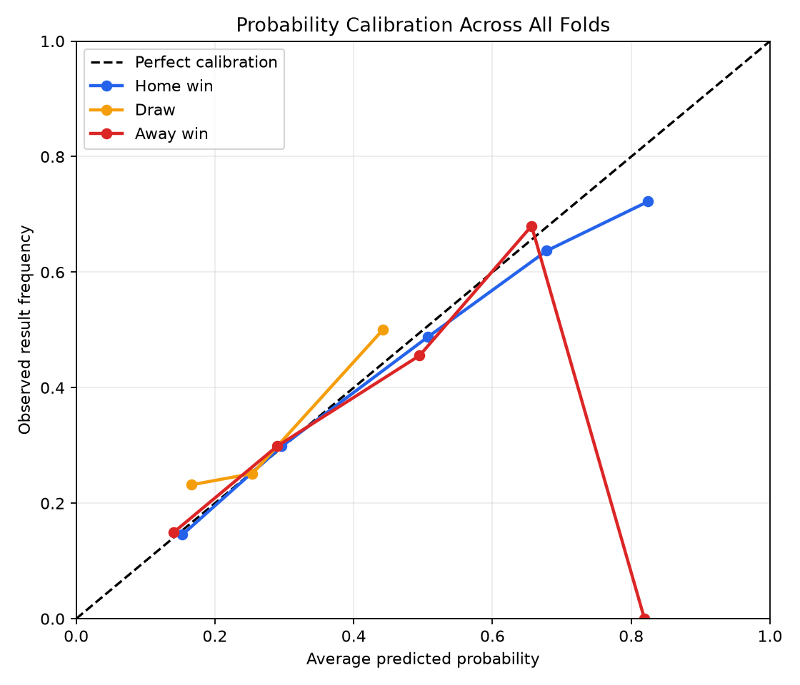
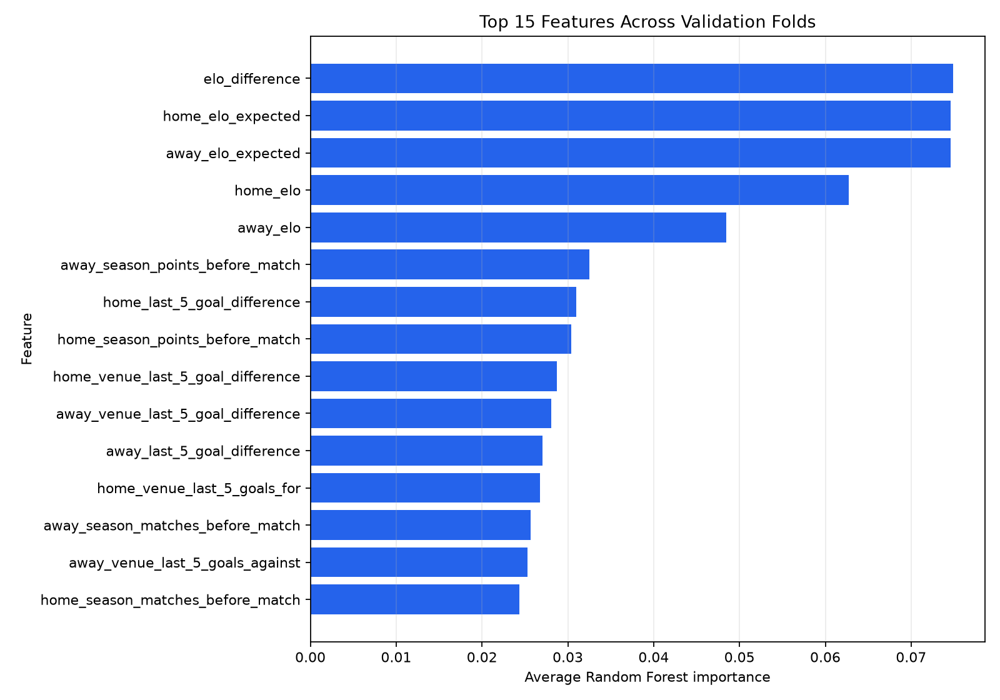

# Phase 7 — Time-Based Validation and Evaluation

## Purpose

This report evaluates the Premier League Random Forest model using expanding-window chronological validation.
Every fold trains only on earlier seasons and tests on the next unseen season.

The production model trained for 2026–27 was not used to produce these evaluation results.

## Validation folds

| Fold | Training seasons | Test season | Training matches | Test matches |
| --- | --- | --- | ---: | ---: |
| 1 | 2020-21 through 2022-23 | 2023-24 | 1,140 | 380 |
| 2 | 2020-21 through 2023-24 | 2024-25 | 1,520 | 380 |
| 3 | 2020-21 through 2024-25 | 2025-26 | 1,900 | 380 |

## Accuracy and probability quality

| Fold | Test season | Baseline accuracy | Model accuracy | Improvement | Log loss |
| ---: | --- | ---: | ---: | ---: | ---: |
| 1 | 2023-24 | 46.1% | 57.4% | +11.3% | 0.948 |
| 2 | 2024-25 | 40.8% | 52.6% | +11.8% | 0.999 |
| 3 | 2025-26 | 42.6% | 47.4% | +4.7% | 1.041 |

### Average results

- Baseline accuracy: **43.2%**
- Random Forest accuracy: **52.5%**
- Accuracy improvement: **+9.3%**
- Random Forest log loss: **0.996**

The Random Forest beat the baseline in all three folds.
However, accuracy decreased from 57.4% in 2023–24 to 47.4% in 2025–26, showing that performance changes between seasons.

## Performance by result class

| Result | Precision | Recall | F1 score |
| --- | ---: | ---: | ---: |
| Home win | 0.550 | 0.765 | 0.639 |
| Draw | 0.167 | 0.007 | 0.014 |
| Away win | 0.489 | 0.595 | 0.536 |

Home wins were the strongest class. Away wins had moderate performance.
Draws were the largest weakness: only 2 of 279 draws were predicted correctly across the three test seasons.
Most actual draws were incorrectly classified as home or away wins.

## Probability calibration

| Result | Average Brier score |
| --- | ---: |
| Home win | 0.215 |
| Draw | 0.186 |
| Away win | 0.193 |

Home-win and away-win probabilities generally followed the observed frequencies.
Draw probabilities were usually low and rarely exceeded 40%, which helps explain why the model almost never selected draws as its final prediction.

## Feature importance

| Rank | Feature | Average importance | Average fold rank |
| ---: | --- | ---: | ---: |
| 1 | `elo_difference` | 0.0749 | 2.0 |
| 2 | `home_elo_expected` | 0.0746 | 2.0 |
| 3 | `away_elo_expected` | 0.0746 | 2.0 |
| 4 | `home_elo` | 0.0627 | 4.0 |
| 5 | `away_elo` | 0.0484 | 5.0 |
| 6 | `away_season_points_before_match` | 0.0325 | 6.3 |
| 7 | `home_last_5_goal_difference` | 0.0310 | 7.3 |
| 8 | `home_season_points_before_match` | 0.0304 | 7.7 |
| 9 | `home_venue_last_5_goal_difference` | 0.0287 | 9.3 |
| 10 | `away_venue_last_5_goal_difference` | 0.0281 | 9.7 |

Elo-based features were the most influential features in every fold.
Feature importance shows what the Random Forest used most often, but it does not prove that a feature causes a match result.

## Main strengths

- Beat the most-frequent-result baseline in every fold.
- Performed best when identifying home wins.
- Produced usable probabilities instead of only class labels.
- Used stable Elo features across different seasons.

## Main weaknesses

- Almost never predicted draws correctly.
- Accuracy and log loss became worse in newer seasons.
- Some high-probability bins contained very few matches.
- The model does not yet include player availability, transfers, injuries, or promoted-team adjustments.

## Conclusion

The Random Forest is better than the simple baseline and provides useful starting probabilities.
Before relying on it for the 2026–27 season, future work should focus on draw detection, probability calibration, and testing additional features.

## Saved evaluation data

- [Fold metrics](tables/fold_metrics.csv)
- [Class metrics](tables/class_metrics.csv)
- [Confusion matrices](tables/confusion_matrices.csv)
- [Brier scores](tables/brier_scores.csv)
- [Calibration metrics](tables/calibration_metrics.csv)
- [Feature importance by fold](tables/feature_importance_by_fold.csv)
- [Feature importance summary](tables/feature_importance_summary.csv)
